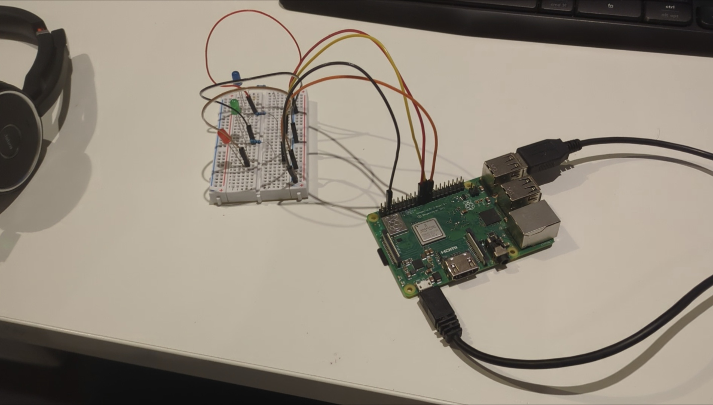

# JarvisAI: Smart Light Control System

JarvisAI is an innovative proof of concept that enables seamless control of home lighting through voice commands. Utilizing a Raspberry Pi and lightweight AI models trained for wake word recognition and speech-to-intent processing, JarvisAI allows users to effortlessly turn on and off lights in various rooms such as the bathroom, living room, and bedroom. This project showcases the integration of advanced AI with practical home automation, providing a glimpse into the future of smart living.



## Features

- Voice-controlled lighting system
- Supports multiple rooms
- Utilizes lightweight AI models for wake word recognition and speech-to-intent processing

## Hardware Requirements

- Raspberry Pi
- 3 LEDs
- Breadboard and jumper wires

## Software Requirements

- Python 3.x
- The following Python libraries (detailed in `requirements.txt`):
  - pvrhino
  - pvporcupine
  - pvrecorder
  - python-dotenv
  - RPi.GPIO

## Setup

### Hardware Setup

1. Connect the 3 LEDs to the Raspberry Pi using a breadboard and jumper wires.
2. Connect the negative legs of the LEDs to the ground (GND) pin on the Raspberry Pi.
3. Connect the positive legs of the LEDs to GPIO pins (GPIO11, GPIO10, GPIO9) on the Raspberry Pi.

### Software Setup

1. Clone the repository to your local machine:

    ```bash
    git clone https://github.com/yourusername/jarvis-ai.git
    cd jarvis-ai
    ```

2. Create and activate a virtual environment (optional but recommended):

    ```bash
    python -m venv venv
    source venv/bin/activate  # On Windows use `venv\Scripts\activate`
    ```

3. Install the required Python packages:

    ```bash
    pip install -r requirements.txt
    ```

4. Set up your environment variables:

    - Create a `.env` file in the project directory.
    - Add the necessary environment variables (e.g., API keys, and path to context files).

### Running the Project

1. Ensure the Raspberry Pi is properly connected to the LEDs.
2. Run the main Python script:

    ```bash
    python main.py
    ```

3. Use voice commands to control the LEDs representing different rooms.

## Contribution

Feel free to contribute to this project by opening issues or submitting pull requests. For major changes, please open an issue first to discuss what you would like to change.
